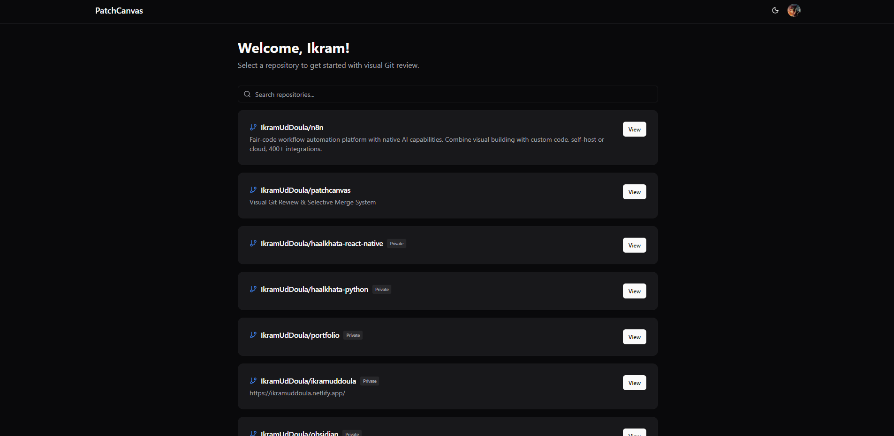
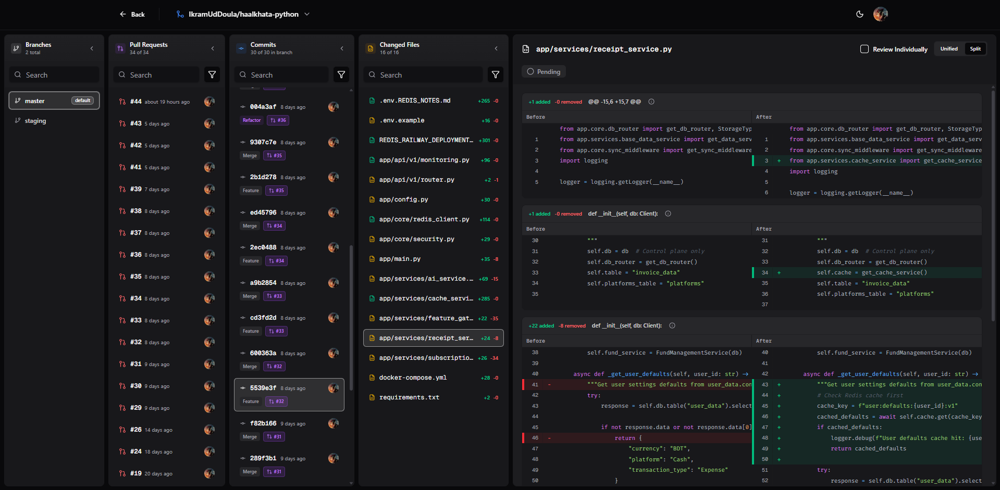

<div align="center">

# 🎨 PatchCanvas

### Visual Git Review & Selective Merge System

Transform Git operations into intuitive drag-and-drop interactions

[](https://opensource.org/licenses/MIT)
[](https://nextjs.org/)
[](https://www.typescriptlang.org/)
[](http://makeapullrequest.com)

[Features](#-features) • [Demo](#-demo) • [Quick Start](#-quick-start) • [Documentation](#-documentation) • [Contributing](#-contributing)

</div>

---

## 📖 Overview

PatchCanvas reimagines code review by providing a visual interface for reviewing changes, managing pull requests, and performing selective merges. Say goodbye to complex Git commands and hello to an intuitive, drag-and-drop workflow that maintains a complete audit trail.

### Why PatchCanvas?

- 🎯 **Visual First**: See your repository as an interactive graph
- 🎨 **Selective Merging**: Cherry-pick files or individual hunks with drag-and-drop
- 🤖 **Smart Analysis**: Automatic commit classification and effort estimation
- 📊 **Review Insights**: Understand PR complexity at a glance
- 🔍 **Audit Trail**: Track every decision throughout the review process
- 🌓 **Beautiful UI**: Dark/light themes with a clean, modern design

## 🎬 Demo

> **Note**: Add screenshots or GIF demos here to showcase the application

```


```

## ✨ Features

<table>
<tr>
<td width="50%">

### 🎨 Visual Interface
- Interactive repository browser
- Drag-and-drop workflow
- Real-time diff visualization
- Syntax highlighting
- Dark/light theme support
- Responsive design

</td>
<td width="50%">

### 🔐 Authentication & Security
- GitHub OAuth via Clerk
- Public & private repo access
- Secure token management
- Protected API routes
- Role-based access control

</td>
</tr>
<tr>
<td width="50%">

### 📊 Intelligent Analysis
- Commit classification (feat/fix/refactor)
- PR effort estimation
- Complexity scoring
- Change categorization
- Risk assessment
- Focus area detection

</td>
<td width="50%">

### 🚀 Performance
- IndexedDB caching
- Service worker support
- Optimized builds
- Code splitting
- Streaming SSR
- React Query integration

</td>
</tr>
</table>

## 🚀 Quick Start

### Prerequisites

- Node.js 20+
- npm or yarn
- GitHub account
- [Clerk account](https://clerk.com) (free tier)

### Installation

```bash
# Clone the repository
git clone https://github.com/yourusername/patchcanvas.git
cd patchcanvas

# Install dependencies
npm install

# Copy environment variables
cp .env.local.example .env.local

# Configure your Clerk keys in .env.local
# Then start the development server
npm run dev
```

Open [http://localhost:8080](http://localhost:8080) and start reviewing! 🎉

## 📚 Documentation

### Configuration

<details>
<summary><b>Setting up Clerk Authentication</b></summary>

1. Create a Clerk account at [dashboard.clerk.com](https://dashboard.clerk.com)
2. Create a new application
3. Enable GitHub OAuth:
   - Navigate to **User & Authentication** → **Social Connections**
   - Enable **GitHub**
4. Copy your API keys to `.env.local`:
   ```env
   NEXT_PUBLIC_CLERK_PUBLISHABLE_KEY=pk_test_...
   CLERK_SECRET_KEY=sk_test_...
   ```

**Important**: Clerk's default GitHub connection only requests `read:user` and `user:email` scopes. To access private repositories, you must programmatically request the `repo` scope using Clerk's `additionalScopes` parameter. See [docs/CLERK_GITHUB_SETUP.md](./docs/CLERK_GITHUB_SETUP.md) for detailed implementation.

</details>

<details>
<summary><b>Environment Variables</b></summary>

| Variable | Required | Description |
|----------|----------|-------------|
| `NEXT_PUBLIC_CLERK_PUBLISHABLE_KEY` | ✅ | Clerk publishable key |
| `CLERK_SECRET_KEY` | ✅ | Clerk secret key |
| `NEXT_PUBLIC_CLERK_SIGN_IN_URL` | ❌ | Sign in URL (default: `/sign-in`) |
| `NEXT_PUBLIC_CLERK_SIGN_UP_URL` | ❌ | Sign up URL (default: `/sign-up`) |
| `NEXT_PUBLIC_CLERK_AFTER_SIGN_IN_URL` | ❌ | Redirect after sign in (default: `/dashboard`) |
| `NEXT_PUBLIC_CLERK_AFTER_SIGN_UP_URL` | ❌ | Redirect after sign up (default: `/dashboard`) |

</details>

### Available Scripts

```bash
npm run dev          # Start development server (port 8080)
npm run build        # Build for production
npm start            # Start production server
npm run lint         # Run ESLint
npm test             # Run tests
npm run test:watch   # Run tests in watch mode
npm run test:ui      # Open Vitest UI
npm run test:coverage # Generate coverage report
```

## 🏗️ Tech Stack

<div align="center">

| Category | Technologies |
|----------|-------------|
| **Frontend** | Next.js 15, React 19, TypeScript 5 |
| **Styling** | Tailwind CSS 4, Shadcn UI, Radix UI |
| **State** | Zustand, TanStack Query (React Query) |
| **Auth** | Clerk, GitHub OAuth |
| **Git** | Octokit REST API |
| **Testing** | Vitest, Testing Library, Fast-check |
| **DX** | ESLint, TypeScript, Hot Reload |

</div>

## 📁 Project Structure

```
patchcanvas/
├── src/
│   ├── app/                    # Next.js App Router
│   │   ├── api/               # API routes (GitHub proxy)
│   │   ├── dashboard/         # Main dashboard
│   │   ├── repo/              # Repository details
│   │   └── sign-in/           # Auth pages
│   ├── components/            # React components
│   │   ├── auth/             # Auth components
│   │   ├── layout/           # Layout (header, nav)
│   │   ├── repo/             # Repo browser & review
│   │   ├── repos/            # Repo list
│   │   └── ui/               # Shadcn components
│   ├── hooks/                # Custom hooks
│   ├── lib/                  # Utilities
│   │   ├── diff/            # Diff parsing
│   │   ├── commit-intelligence.ts
│   │   ├── pr-intelligence.ts
│   │   └── github.ts
│   └── stores/              # Zustand stores
├── public/                  # Static assets
├── .env.local.example      # Environment template
├── docker-compose.yml      # Docker setup
└── vitest.config.mts       # Test config
```

## 🧪 Testing

We use Vitest with React Testing Library and property-based testing:

```bash
# Run all tests
npm test

# Watch mode
npm run test:watch

# UI mode for debugging
npm run test:ui

# Coverage report
npm run test:coverage
```

## 🐳 Docker Deployment

```bash
# Quick start with Docker Compose
docker-compose up -d

# Or build manually
docker build -t patchcanvas .
docker run -p 3000:3000 --env-file .env patchcanvas
```

See [DOCKER_DEPLOYMENT.md](./DOCKER_DEPLOYMENT.md) for detailed instructions.

## 🤝 Contributing

We love contributions! PatchCanvas is open source and community-driven.

### How to Contribute

1. **Fork** the repository
2. **Clone** your fork: `git clone https://github.com/yourusername/patchcanvas.git`
3. **Create** a branch: `git checkout -b feature/amazing-feature`
4. **Make** your changes
5. **Test** your changes: `npm test`
6. **Commit** with a clear message: `git commit -m 'Add amazing feature'`
7. **Push** to your fork: `git push origin feature/amazing-feature`
8. **Open** a Pull Request

### Development Guidelines

- ✅ Write tests for new features
- ✅ Follow the existing code style
- ✅ Update documentation as needed
- ✅ Keep PRs focused and atomic
- ✅ Add meaningful commit messages

### Good First Issues

Looking for a place to start? Check out issues labeled [`good first issue`](https://github.com/yourusername/patchcanvas/labels/good%20first%20issue) or [`help wanted`](https://github.com/yourusername/patchcanvas/labels/help%20wanted).

## 🐛 Bug Reports & Feature Requests

Found a bug or have an idea? We'd love to hear from you!

- 🐛 [Report a bug](https://github.com/yourusername/patchcanvas/issues/new?labels=bug)
- 💡 [Request a feature](https://github.com/yourusername/patchcanvas/issues/new?labels=enhancement)
- 💬 [Start a discussion](https://github.com/yourusername/patchcanvas/discussions)

## 🔧 Troubleshooting

<details>
<summary><b>Private repositories not showing</b></summary>

**This is the most common issue!** It happens when the GitHub token lacks the `repo` scope.

**Root Cause**: Clerk's default GitHub OAuth only requests `read:user` and `user:email` scopes, which don't include access to private repositories.

**Solution - Implement Scope Request**:

Add this code to request the `repo` scope when users connect GitHub:

```typescript
import { useSignIn } from '@clerk/nextjs';

const { signIn } = useSignIn();

await signIn?.authenticateWithRedirect({
  strategy: 'oauth_github',
  redirectUrl: '/dashboard',
  redirectUrlComplete: '/dashboard',
  additionalScopes: ['repo'], // Request private repo access
});
```

For existing users, trigger reauthorization:

```typescript
import { useUser } from '@clerk/nextjs';

const { user } = useUser();
const githubAccount = user?.externalAccounts.find(
  acc => acc.provider === 'github'
);

await githubAccount?.reauthorize({
  additionalScopes: ['repo'],
  redirectUrl: '/dashboard',
});
```

**Debug Token Issues:**
```bash
# Check token scopes and permissions
curl http://localhost:8080/api/github/diagnostics
```

See [docs/CLERK_GITHUB_SETUP.md](./docs/CLERK_GITHUB_SETUP.md) for complete implementation guide.

</details>

<details>
<summary><b>Build errors</b></summary>

```bash
# Clear caches and rebuild
rm -rf .next node_modules package-lock.json
npm install
npm run build
```

</details>

<details>
<summary><b>Port already in use</b></summary>

```bash
# Use a different port
PORT=3000 npm run dev
```

</details>

<details>
<summary><b>Docker issues</b></summary>

```bash
# Check logs
docker-compose logs app

# Rebuild without cache
docker-compose build --no-cache
```

</details>

## 🗺️ Roadmap

- [ ] Advanced merge conflict resolution
- [ ] Team collaboration features
- [ ] Custom review workflows
- [ ] CI/CD pipeline integration
- [ ] VS Code extension
- [ ] Mobile app
- [ ] Webhook support
- [ ] Custom commit templates
- [ ] Review analytics dashboard
- [ ] Multi-repository views

## 📄 License

This project is licensed under the MIT License - see the [LICENSE](LICENSE) file for details.

## 🙏 Acknowledgments

Built with amazing open source projects:

- [Next.js](https://nextjs.org/) - The React Framework
- [Clerk](https://clerk.com/) - Authentication & User Management
- [Shadcn UI](https://ui.shadcn.com/) - Beautiful UI Components
- [Tailwind CSS](https://tailwindcss.com/) - Utility-first CSS
- [Radix UI](https://www.radix-ui.com/) - Accessible Primitives
- [Octokit](https://github.com/octokit) - GitHub API Client
- [Vitest](https://vitest.dev/) - Fast Unit Testing

## 💖 Support

If you find PatchCanvas helpful, please consider:

- ⭐ Starring the repository
- 🐦 Sharing on social media
- 📝 Writing a blog post
- 💬 Telling your friends

## 📞 Contact & Community

- 🌐 Website: [patchcanvas.dev](https://patchcanvas.dev) *(coming soon)*
- 🐦 Twitter: [@patchcanvas](https://twitter.com/patchcanvas) *(coming soon)*
- 💬 Discord: [Join our community](https://discord.gg/patchcanvas) *(coming soon)*
- 📧 Email: hello@patchcanvas.dev *(coming soon)*

---

<div align="center">

**Made with ❤️ by the open source community**

[⬆ Back to Top](#-patchcanvas)

</div>
